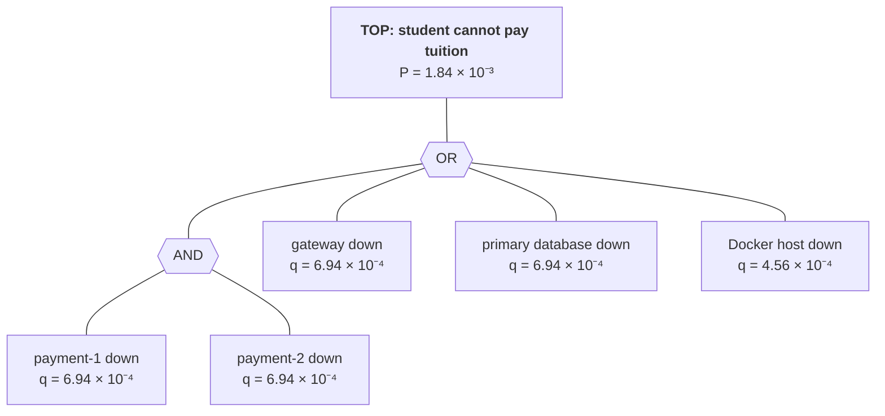

# Fault-Tolerant University Information System — Technical Report

Course: Fault Tolerance and Dependable Computing — Midterm project

Every number in this report comes from the raw logs in `results/` or from a
calculation shown next to it. The per-run reports, the generated comparison and
the methodology are in `results/`; this document ties them to the dependability
analysis and the design.

---

## 1. Introduction and project motivation

A university platform has a few operations that must not fail at the wrong
moment: registering during the registration window, paying tuition before a
deadline, getting a transcript for an application, publishing the term's
timetable. Each fails in its own way. A registration outage is lost
availability. A double tuition charge is lost integrity, and it is worse than an
outage because nobody notices it until a student complains. A timetable job that
dies halfway and never finishes is a silent omission.

The project builds a small distributed version of such a platform twice: a
**baseline** with no fault-tolerance logic, and a **fault-tolerant (FT)** version.
Both run the same container image; one environment variable switches between
them. The same faults are injected into both at the same moment, under the same
workload, so every measured difference comes from the fault-tolerance mechanisms.

## 2. System requirements and assumptions

### 2.1 Functional scope

| Service | Operations |
|---|---|
| Student | look up a student, create/update a student |
| Payment | charge tuition (`POST`, with `Idempotency-Key`), look up a payment |
| Transcript | a student's grades and GPA |
| Timetable | generate a term's timetable (a long-running job), poll its progress, read the result |

### 2.2 Dependability requirements

Set before the analysis and checked against the measurements in §10.4.

| ID | Requirement | Rationale |
|---|---|---|
| REQ-1 | Reads stay ≥ 99.9 % successful (request-based) under any single injected fault | students must still see their records during an incident |
| REQ-2 | Payments stay ≥ 99 % successful while at least one payment instance and the primary database are alive | a write needs a writable copy. Without one, failing fast is the correct behaviour |
| REQ-3 | Zero duplicate charges and zero orphaned (half-finished) payments at the end of every run | integrity matters more than availability for money |
| REQ-4 | A crashed or killed instance is detected within 1 s | detection bounds everything that follows |
| REQ-5 | No client-visible outage (a fully failed second) longer than 5 s | short enough that a user retry succeeds |
| REQ-6 | An interrupted timetable job completes without restarting from zero | generation is expensive. Losing it silently is an omission failure |

### 2.3 Coverage of the assignment requirements

| Assignment §4 | Where it is met |
|---|---|
| 1. Baseline without advanced FT | `FT_ENABLED=0`, `RESTART_POLICY=no`: same image, mechanisms off (§8.2) |
| 2. ≥ 5 failure scenarios | 6 measured scenarios (§3.3), plus the timetable crash scenario (demo + unit tests) |
| 3. ≥ 3 independent services | student, payment, transcript, timetable, plus the gateway |
| 4. ≥ 2 hardware/infrastructure mechanisms | replication + load balancing, database replication, self-healing restarts, storage checksums (§6.2) |
| 5. ≥ 4 software mechanisms | ten, listed in §7 |
| 6. Failure and recovery data | `results/*/workload.jsonl.gz`, `events.jsonl.gz`, `metrics.json` |
| 7. Baseline vs FT comparison | §10, `results/COMPARISON.md` |
| 8. Assumptions, decisions, experiments, results | this report, `docs/ARCHITECTURE.md`, `results/METHODOLOGY.md` |

### 2.4 Assumptions

* **Fail-stop components.** A process either works correctly or stops. It may also
  answer slowly (timing faults). Byzantine faults, where a component returns
  plausible but wrong answers, are out of scope, except for storage corruption,
  which page checksums detect (§6.4).
* **One fault at a time**, except in the node-failure scenario, which removes two
  instances together on purpose to model a correlated failure.
* **One Docker host.** Containers stand in for nodes. Their network is reliable
  apart from the delay that is injected deliberately. Every timestamp comes from
  one clock, so there is no clock skew in the measurements.
* **Trusted internal network.** The database uses trust authentication inside the
  Compose network (`pg/pg_hba.conf`). Confidentiality is out of scope.
* **Component failure rates** for the analytical model (§4) are assumptions,
  stated where they are used, because no field data exists for this system.

## 3. Dependability and fault model

### 3.1 Attributes

Using the taxonomy of Avižienis et al. [1], the attributes that matter here are
**availability** (REQ-1, REQ-2, REQ-5), **reliability** (MTTF, failure rate, §4),
**integrity** (REQ-3: no money taken twice, no half-finished payments) and
**maintainability** (REQ-4, REQ-6: detection and recovery time). Safety does not
apply, and confidentiality is out of scope (§2.4).

### 3.2 Fault classes

| Class | Example in this system | Persistence |
|---|---|---|
| Crash (fail-stop) | a service process exits; a node disappears | transient (restart fixes it) or permanent until repaired |
| Omission | a request is never answered; a job is never finished | follows from a crash |
| Timing (performance) | an instance answers in 3 s instead of 10 ms | intermittent |
| Value | a corrupted disk page; a DRAM bit flip | permanent once written |
| Overload (external) | demand beyond what the system was sized for | for as long as the demand lasts |

### 3.3 Fault → error → failure chains

A fault becomes an error (an incorrect internal state), and the error becomes a
failure only when it reaches a client. Each fault-tolerance mechanism breaks one
of these chains at a known point.

| Scenario | Fault | Error (internal state) | Failure in the baseline | Where FT breaks the chain |
|---|---|---|---|---|
| Application crash | student-1 hits a fatal error and exits | the gateway still routes half the student calls to a dead port | 10.0 % of all requests fail (503) | **masking** (each failed call is retried on student-2) and **repair** (the restart policy brings student-1 back in about 1 s, faster than the health check polls) |
| Database failure | the PostgreSQL primary stops | the connection pools cannot reach the primary, so queries hang | requests hang for up to 10 s, then the client gives up: a 10 s outage | **reads** fail over to the standby or the stale cache. **Writes** fail fast, which turns a timing failure into a clean, retryable omission |
| Network / service timeout | 3 s latency on student-1 | requests queue behind the delay, but the instance stays "healthy" | late responses (timing failure) and throughput down to 11 req/s | the **per-attempt timeout** plus a **retry** on the other replica bound the delay to about 1.2 s |
| Node failure | student-1 and payment-1 are killed together | two instances are unreachable | 14.8 % of requests fail | **replication**: the surviving node carries all the load |
| Interrupted transaction | payment dies after the checkpoint and before the commit | a `pending` row with no charge behind it (a latent error) | an orphaned `pending` row forever, and a second charge when the client resends | the **recovery sweep** rolls the checkpoint back, and the **idempotency key** recognises the resend |
| High load | 110 instead of 10 concurrent clients | queues lengthen | latency rises (p95 15 → 135 ms). No request failed (§10.2) | timeouts bound queueing. Monitoring makes it visible |
| Timetable job interrupted | the instance generating a timetable crashes | the in-memory progress is lost, and the job row still says `running` | the job never finishes (omission) | a **checkpoint** keeps the progress durable, and a **lease** lets the other replica adopt and resume the job |

## 4. Reliability and failure analysis

### 4.1 Definitions

For a component with a constant failure rate λ:

* MTTF = 1/λ, and reliability over a mission time *t* is R(t) = e^(−λt)
* MTBF = MTTF + MTTR
* steady-state availability A = MTTF / (MTTF + MTTR) = MTTF / MTBF
* series (all needed): A = ∏ Aᵢ. Parallel (any one suffices): A = 1 − ∏ (1 − Aᵢ)
* unavailability q = 1 − A, and downtime per year = q × 8760 h

The *measured* definitions (time bins, outages, censoring when no failure occurs)
are in `results/METHODOLOGY.md` §5 and `scripts/metrics.ts`.

### 4.2 Component assumptions

| Parameter | Value | Reason |
|---|---|---|
| Component MTTF | 720 h (λ = 1.39 × 10⁻³ /h) | one failure per component per month. This is the same assumption as `results/COMPARISON.md` §5 |
| MTTR, manual repair | 0.5 h | an operator is paged, diagnoses the fault and restarts the service. This is the baseline's only repair path |
| MTTR, automatic repair | 10 s | restart policy plus about 1 s of health-check detection. It applies to crash faults only |
| Host MTTF / MTTR | 8760 h / 4 h | one hardware incident per year, with a replacement or re-provisioning time |

This gives these per-component availabilities:
A_manual = 0.999306 (q = 6.94 × 10⁻⁴), A_auto = 0.99999614 (q = 3.86 × 10⁻⁶) and
A_host = 0.999544 (q = 4.56 × 10⁻⁴).

**Reliability is not availability.** Without repair, one component survives
a registration week (168 h) with R = e^(−168/720) = 0.792. A replicated pair
survives it with 1 − (1 − 0.792)² = 0.957. Over a 720 h month these figures drop
to 0.368 and 0.600. Replication helps, but repair is what keeps availability high
over long periods.

### 4.3 Reliability block diagrams

Each user-facing operation is a series of the components it needs.

* **Pay tuition:** gateway → payment (pair) → primary database. Writes cannot use
  the standby.
* **Read transcript:** gateway → transcript-1 → database (primary ∥ standby).
* **Student lookup:** gateway → student (pair) → database (primary ∥ standby).

In the **baseline** the replicas are in **series**, not parallel. With no health
checks the gateway keeps sending calls to a dead replica, so either replica
failing breaks the operation. This is pessimistic, because a dead replica fails
about half the calls rather than all of them. The baseline also cannot use the
standby.

| Operation | Baseline (series, manual repair) | FT, crash faults (auto repair) | FT, hardware faults (manual repair) | FT + the shared host | Fully redundant design (§6.6) |
|---|---|---|---|---|---|
| Pay tuition | 99.7227 % · 1457 min/yr | 99.9992 % · 4 min/yr | 99.8612 % · 729 min/yr | 99.8156 % · 969 min/yr | 99.9998 % · 1 min/yr |
| Read transcript | 99.7920 % · 1093 min/yr | 99.9992 % · 4 min/yr | 99.8612 % · 729 min/yr | 99.8156 % · 969 min/yr | 99.9998 % · 1 min/yr |
| Student lookup | 99.7227 % · 1457 min/yr | 99.9996 % · 2 min/yr | 99.9305 % · 365 min/yr | 99.8849 % · 605 min/yr | 99.9998 % · 1 min/yr |

The table shows three things:

1. **Against crash faults the FT version gains almost three nines.** Most of the gain comes from
   the restart policy (MTTR drops from 30 min to 10 s), not from replication.
2. **Against hardware faults, which a restart cannot fix, FT only halves the
   downtime.** Replication removed the payment pair from the critical path, but the
   gateway and the primary database are still single components in series, and
   each contributes q = 6.94 × 10⁻⁴.
3. **The shared host costs more than replication buys.** Every container runs on
   one machine, so the host is a common-mode failure that sits in series with
   everything.

### 4.4 Fault tree and single points of failure

Top event: **a student cannot pay tuition** (FT version, manual-repair
unavailabilities from §4.2).



P(TOP) = 1 − (1 − q_gw)(1 − q_db)(1 − q_host)(1 − q_p1·q_p2) = **1.84 × 10⁻³**

**Minimal cut sets:** {gateway}, {primary database}, {host}, {payment-1, payment-2}.
Every first-order cut set is a single point of failure. The contributions to P(TOP) are:

| Cut set | Probability | Share of P(TOP) |
|---|---|---|
| {gateway} | 6.94 × 10⁻⁴ | 37.6 % |
| {primary database} | 6.94 × 10⁻⁴ | 37.6 % |
| {host} | 4.56 × 10⁻⁴ | 24.8 % |
| {payment-1, payment-2} | 4.82 × 10⁻⁷ | 0.03 % |

In the **baseline** the AND gate is an OR: each payment replica is its own cut set,
and P(TOP) = 3.23 × 10⁻³. The payment tier's contribution fell from
2q = 1.39 × 10⁻³ to q² = 4.8 × 10⁻⁷, about 2900 times less, so it is no longer the
problem. What remains is
almost entirely the three single components.

The same analysis for **"a transcript cannot be read"** gives the minimal cut sets
{gateway}, {host}, {transcript-1} and {primary, standby, stale cache}. Here
transcript-1 is a single point of failure. The stale cache covers it only for
transcripts that someone read in the last 60 s.

| Single point of failure | Effect | Remedy (not implemented, §6.6) |
|---|---|---|
| gateway | total outage | two gateways behind a virtual IP (keepalived) or a Kubernetes Service |
| postgres-primary | no writes; reads continue from the standby | automatic promotion of the standby (Patroni) |
| transcript-1 | transcripts only from the stale cache | a second replica |
| Docker host | total outage, common mode | spread the replicas across at least two hosts |
| `./logs` bind mount | monitoring and measurement lost; service unaffected | ship the logs off-host |

### 4.5 Failure mode and effects analysis (FMEA)

S = severity, O = occurrence, D = detection, each on a 1–10 scale (1 means
detected automatically within 1 s, 10 means never detected).
RPN = S × O × D. The scores are the team's estimates, with the evidence in the last column.

| # | Item / failure mode | Effect on users | S/O/D baseline | RPN | S/O/D FT | RPN | FT mitigation (evidence) |
|---|---|---|---|---|---|---|---|
| 1 | Service instance crashes | calls routed to it fail | 7/5/8 | 280 | 2/5/2 | 20 | health check, retry, restart (app-crash: 1200 → 0 real failures) |
| 2 | Instance alive but slow | late answers, throughput collapses | 5/4/10 | 200 | 4/4/6 | 96 | timeout + retry (max 3021 → 1201 ms). The instance stays in rotation (§11) |
| 3 | Gateway crashes | total outage | 10/3/8 | 240 | 10/3/3 | 90 | restart policy and Prometheus `up`. Still a SPOF |
| 4 | Transcript instance crashes | transcripts unavailable | 6/5/8 | 240 | 4/5/2 | 40 | stale cache (203), restart |
| 5 | Primary database down | everything hangs | 9/3/8 | 216 | 6/3/2 | 36 | standby reads, stale cache, writes fail fast (db-failure: 10 s outage → 0) |
| 6 | Payment dies between checkpoint and commit | half-finished payment, never reconciled | 8/3/10 | 240 | 2/3/2 | 12 | recovery sweep (txn-interrupt: 2 → 0 orphans) |
| 7 | Client resends a payment | money taken twice, silently | 9/8/10 | 720 | 1/8/1 | 8 | idempotency key (3210 → 0 duplicate charges) |
| 8 | Timetable worker crashes mid-job | the job never finishes | 6/4/10 | 240 | 2/4/3 | 24 | checkpoint + lease adoption (unit-tested, demo) |
| 9 | Docker host fails | total outage | 10/2/5 | 100 | 10/2/5 | 100 | none. A common-mode SPOF |
| 10 | Disk page corrupted | wrong data served silently | 9/2/9 | 162 | 9/2/3 | 54 | page checksums detect it on read. They cannot correct it |
| 11 | DRAM bit flip | wrong value written as if valid | 9/2/10 | 180 | 9/2/10 | 180 | needs ECC RAM (§6.5). 36 with ECC |
| 12 | Demand beyond sizing | latency grows | 5/5/7 | 175 | 5/5/4 | 100 | timeouts bound queueing. Prometheus makes it visible |

The highest baseline risk is the **duplicate charge (RPN 720)**. It is frequent, it
is severe, and nothing detects it. The mechanism that removes it is one database
constraint. The highest residual risks in the FT version are the ones that
software on one host cannot address: the host itself (9), memory corruption (11)
and the gateway (3).

### 4.6 Measured reliability metrics

From the twelve-run campaign (`results/COMPARISON.md` §2): each version ran
423 s of observation with six injected faults.

| Metric | Baseline | Fault-tolerant |
|---|---|---|
| Requests / failed | 93 300 / 4 260 | 94 129 / 789 |
| Failed, excluding requests cut off at the window close | 4 157 | 714 |
| Availability, request-based | 95.43 % | 99.16 % |
| Availability, time-based | 99.74 % | 100.00 % |
| Observed outages | 1 | 0 |
| MTTF | 413.1 s | > 423 s (right-censored: no outage) |
| MTBF | 423.1 s (MTTF + MTTR) | n/a |
| MTTR | 10.0 s | n/a: nothing to repair |
| Observed failure rate | 8.5 outages/h | 0 /h |
| Requests rescued by retry | — | 285 |
| Duplicate charges / orphaned payments | 3 210 / 2 | 0 / 0 |

**Theory against measurement.** The analytical model predicts 99.998 % for the
baseline, against 99.74 % measured. The gap is expected. The campaign injects one
fault every 70 s, about 37 000 times the assumed rate of one failure per month,
and the node-failure scenario breaks the independence assumption on purpose. The
FT version's 100 % is censored: no outage was observed, so the measurement is
consistent with the model but cannot confirm it. The model and the experiment
agree on the *ordering* and on *where* the remaining risk sits. Under fault
injection every FT failure that a client saw came from a component without a
partner: no writable database in db-failure, both payment replicas killed in
txn-interrupt.

## 5. System architecture

See **`docs/ARCHITECTURE.md`** for the deployment diagram, the component table and
the request flow. In short: one gateway, two replicas each of student, payment
and timetable, one transcript service, a PostgreSQL primary with a hot standby
fed by streaming replication, one shared JSON event log, and optionally
Prometheus.

## 6. Hardware fault-tolerance design

### 6.1 Kinds of redundancy used

| Redundancy | Meaning | Here |
|---|---|---|
| Spatial (hardware) | more copies of a component | service replicas, database standby |
| Information | extra bits that detect or correct errors | page checksums. ECC (documented). Idempotency keys at the protocol level |
| Time | doing the work again | retries, the recovery sweep, resuming a timetable job |

### 6.2 Implemented infrastructure mechanisms

| # | Mechanism | Configuration | Evidence |
|---|---|---|---|
| H1 | **Service replication + load balancing** | student, payment and timetable run as pairs. The gateway round-robins over healthy instances | node failure: 1845 failed requests in the baseline, **0** in FT |
| H2 | **Database replication** | PostgreSQL 16 streaming replication. The standby is cloned with `pg_basebackup` and serves reads as a hot standby | db-failure: 169 reads served by the standby. Zero client-visible outage for reads |
| H3 | **Self-healing** | `restart: unless-stopped`, the Compose analogue of a Kubernetes ReplicaSet | app-crash: student-1 answered again about 1 s after the crash, with no operator involved |
| H4 | **Storage checksums** | `initdb --data-checksums`: every 8 kB page carries a checksum, verified on read. The standby inherits it | configured. No experiment corrupts a page. Verify with `SHOW data_checksums;` |
| H5 | **Independent monitoring** | Prometheus scrapes `/metrics` on all eight instances every 2 s. Its `up` series detects a silent instance without relying on the gateway | `docker compose --profile monitoring up -d` |

The **node-failure** scenario is the one that shows hardware fault tolerance end
to end. One "machine" (student-1 + payment-1) disappears, and the platform loses
capacity but not availability.

### 6.3 RAID (concept, not deployable in containers)

Containers cannot build arrays from physical disks, so RAID is part of the design
rather than the deployment. It belongs under the database's data directory.

| Level | Layout | Survives | Usable capacity (4 disks) | Write cost |
|---|---|---|---|---|
| RAID 0 | striping | nothing | 4 disks | none |
| RAID 1 | mirroring | one disk per mirror | 2 disks | one write per copy |
| RAID 5 | striping + distributed parity | any one disk | 3 disks | read-modify-write of the parity |
| RAID 10 | mirrored pairs, striped | one disk per pair | 2 disks | one write per copy |

Mean time to data loss, with disk MTTF = 10⁶ h (vendor figure, ~0.9 % annual
failure rate) and a 24 h rebuild:

* a single disk: MTTDL = 10⁶ h
* RAID 1: MTTDL = MTTF² / (2 · MTTR) = 10¹² / 48 ≈ **2.1 × 10¹⁰ h**
* RAID 5, 4 disks: MTTDL = MTTF² / (N(N−1) · MTTR) = 10¹² / 288 ≈ 3.5 × 10⁹ h
* RAID 10, 4 disks (two pairs): ≈ 1.0 × 10¹⁰ h

**Recommendation: RAID 10 for the PostgreSQL volume.** The workload is
write-heavy (every payment writes at least twice), RAID 5's parity update
penalises writes, and a RAID 10 rebuild copies one disk instead of reading the
whole array. Streaming replication (H2) is effectively **RAID 1 across machines**.
It also survives the loss of the controller, the host or the whole server, which
RAID does not.

### 6.4 Information redundancy for storage

RAID protects against a disk that *stops*. It does not protect against a disk that
returns *wrong data*. Page checksums (H4) cover that case. A corrupted page is
reported as an error instead of being served, which turns a silent value failure
into a detectable crash failure, and the remedy is then to re-read from the
standby or a backup. A checksum detects but does not correct.

### 6.5 ECC memory (documented hardware mechanism)

ECC DRAM stores 8 check bits for every 64 data bits, a (72, 64) Hamming SECDED
code [7]. It **corrects any single-bit error and detects any double-bit error** in
a memory word. This matters because a field study of Google's fleet found that
about a third of machines and over 8 % of DIMMs see at least one correctable error
per year [6]. A flipped bit in a student's balance in memory is a value failure
that no software mechanism in this project catches. The replica would faithfully
copy the wrong value, and a retry would compute with it again. ECC is the only
layer that prevents it, so **ECC RAM is a requirement for the database hosts**. It
cannot be shown in containers, so it is documented here instead (FMEA row 11).

### 6.6 Backup infrastructure and the remaining SPOFs

* **The standby is not a backup.** Replication copies a bad `UPDATE` or a
  `DROP TABLE` within milliseconds. Backups protect against logical errors:
  a nightly `pg_basebackup` plus continuous WAL archiving gives point-in-time
  recovery. Keep three copies on two media types, one of them off-site (the 3-2-1 rule).
* **Replication is asynchronous** (the PostgreSQL default). If the primary's disk
  is lost, the last few transactions not yet shipped are lost too, so the RPO is a
  few seconds. `synchronous_commit` with a synchronous standby gives RPO = 0
  at the cost of commit latency.
* **The fully redundant design** of §4.3 removes the first-order cut sets: two
  gateways behind a virtual IP, a second transcript replica, automatic standby
  promotion (Patroni), and replicas spread across at least two hosts (Kubernetes
  pod anti-affinity). That model gives 99.9998 % (1 min/yr) even with manual repair.

## 7. Software fault-tolerance design

| # | Mechanism | Where | How it works | Evidence (FT campaign) |
|---|---|---|---|---|
| S1 | **Retry with exponential backoff + full jitter** | `app/ft.py` `call()` | up to 3 attempts on transport errors and 5xx, never on 4xx. Sleep = U(0,1) × 50 ms × 2^(n−1). Each retry goes to the *next* instance in the ring | 285 requests rescued |
| S2 | **Timeouts** | `app/ft.py`, `app/db.py`, gateway probe | 800 ms per attempt. 1 s to acquire a database connection. 300 ms for the health probe's own database check, inside the 500 ms probe | net-timeout worst case 3021 → 1201 ms |
| S3 | **Circuit breaker** | `app/ft.py` `CircuitBreaker` | per pool. Opens after 5 consecutive failures, fails fast for 5 s, then lets one trial through (half-open) | 4 openings (db-failure 3, txn-interrupt 1) |
| S4 | **Health checks** | `app/gateway.py` | `/health` polled every 1 s. Unhealthy instances leave the rotation | node failure: both instances marked down 0.6 s after the kill, back in rotation 1.8 s after the repair. db-failure: 1.1–1.5 s |
| S5 | **Idempotent processing + duplicate detection** | `app/payment.py`, `sql/10-schema.sql` | `UNIQUE idempotency_key` + `ON CONFLICT DO NOTHING`. A duplicate returns the original result (HTTP 200) and charges nothing. The gateway generates a key if the client sent none, so its own retries are safe | 3 523 duplicates suppressed, **0** duplicate charges |
| S6 | **Checkpointing + rollback/recovery (payments)** | `app/payment.py` | a `pending` row is written before the charge. A sweep rolls back checkpoints older than 10 s, at boot and periodically | 2 checkpoints rolled back, **0** orphans |
| S7 | **Graceful degradation** | `app/gateway.py`, `app/transcript.py`, `app/db.py` | reads go to the standby. Stale data under 60 s old is served with HTTP 203 and `degraded: true` | 169 standby reads, 1 422 degraded responses |
| S8 | **Fail-fast writes** | `app/db.py` | a bounded connection-acquire timeout instead of waiting for a dead primary | db-failure: failed writes answered in 5 ms median, 29 ms p95, instead of hanging |
| S9 | **Service replication** | `docker-compose.yml`, gateway ring | stateless replicas behind the gateway | node failure: 0 failed requests |
| S10 | **Checkpointing + lease-based job adoption (timetable)** | `app/timetable.py`, `app/schedule.py` | progress is saved every 10 placements, renewing a 3 s lease. A live replica claims an expired lease atomically (`FOR UPDATE SKIP LOCKED`) and resumes from the checkpoint. An owner that has lost its lease is fenced off at its next write | unit tests: resuming at any point gives exactly the uninterrupted timetable. Demo scenario |

**The mechanisms depend on each other.** Retrying a `POST` is only safe because
of S5, so the gateway propagates the idempotency key. A health check is only
useful if its own deadline is shorter than the prober's (`results/METHODOLOGY.md`
§8 records the defect this caused). And timetable resumption is only correct
because placement is deterministic: a checkpoint is just a prefix of the
placements, and `tests/test_schedule.py` checks this property directly.

## 8. Implementation

### 8.1 Stack

Python 3.12 + FastAPI + httpx + psycopg 3 for the services, PostgreSQL 16, Docker
Compose, a Node 22 TypeScript measurement harness (run with
`--experimental-strip-types`, no build step), and Prometheus 2.53.

### 8.2 One image, two versions

`FT_ENABLED` is read where each mechanism is used, and every software mechanism
is gated on it. `RESTART_POLICY` gates self-healing. The replicas, the standby and
the checksums exist in both versions: hardware redundancy without the software
that uses it is exactly what the baseline measures.

### 8.3 Source map

| Path | Content |
|---|---|
| `app/ft.py` | retry, timeout, circuit breaker. Standard library only |
| `app/db.py` | connection pools, read failover, transactions, health probe |
| `app/gateway.py` | load balancer, health loop, degradation |
| `app/student.py`, `app/payment.py`, `app/transcript.py`, `app/timetable.py` | the services |
| `app/schedule.py` | pure, deterministic timetable placement |
| `app/eventlog.py` | the JSONL event log and its Prometheus exposition |
| `app/chaos.py` | fault-injection control plane (`/chaos`, `/chaos/crash`) |
| `scripts/` | workload, scenarios, metrics, runner, comparison, demo |
| `tests/` | 10 self-checks (`python -m unittest discover -s tests -t .`) |
| `monitoring/prometheus.yml` | scrape configuration and useful queries |

## 9. Experimental methodology

The full methodology is in `results/METHODOLOGY.md`. In brief:

* 10 concurrent clients, a 50 ms think time, and a mix of 60 % student reads,
  20 % transcript reads and 20 % payments. 20 % of payment intents are re-sent
  with the same key.
* A fixed schedule: workload from T+0, fault injected at T+20 s, operator repair
  at T+45 s, window closed at T+70 s. The repair is issued in both versions.
* The platform is restored to a healthy state before every run, with streaming
  replication confirmed, and the payment ledger is reset.
* Raw data: one line per client request (`workload.jsonl`) and one line per
  service event (`events.jsonl`), kept gzipped per run. Every metric can be
  recomputed from them.
* Data consistency is checked against the database after every run: duplicates
  per intent, orphaned checkpoints, and ledger balance.

The timetable scenario is **not** part of the measured campaign. It is verified by
unit tests and by `scripts/demo.sh timetable` (§14.3).

## 10. Results and comparison

### 10.1 Per scenario

| Scenario | Failed, baseline | Failed, FT | Detection, FT | Duplicate charges (B → FT) | Orphans (B → FT) |
|---|---|---|---|---|---|
| Application crash | 1200 / 11982 | 1 / 12350 ¹ | 103 ms | 445 → 0 | 0 → 0 |
| Database failure | 35 / 7175 ² | 532 / 8704 ³ | 367 ms | 258 → 0 | 0 → 0 |
| Network / service timeout | 0 / 8261 ⁴ | 0 / 8646 | 848 ms | 334 → 0 | 0 → 0 |
| Hardware / node failure | 1845 / 12469 | 0 / 12645 | 359 ms | 305 → 0 | 0 → 0 |
| Interrupted transaction | 1084 / 12531 | 190 / 12567 ⁵ | 6 ms | 307 → 0 | 2 → 0 |
| High load | 96 / 40882 ¹ | 66 / 39217 ¹ | — ¹ | 1561 → 0 | 0 → 0 |

¹ Requests still in flight when the window closed count as failed (methodology
definition). In app-crash FT this is the only failure. In high-load it is *every*
failure in both versions, and the "detection time" there (~50 s) is the window
closing.
² A small number only because 20 requests hung for the client's full 10 s, and
a blocked client stops sending. Throughput fell to 7175 requests and the service
was down for 10.0 s.
³ Payment writes that failed fast because no writable database existed. Reads:
99.99 %.
⁴ No failures, but 80 requests took about 3 s, and throughput during the fault fell
from 178 to 11 requests/s.
⁵ 183 payment `503`s in the ~5 s while both payment replicas were dead and
restarting, plus 7 cut off at the window close.

### 10.2 Reads and writes separately

A single availability figure hides the most important difference: whether reads
or writes failed.

| Scenario | Reads, baseline | Reads, FT | Payments, baseline | Payments, FT |
|---|---|---|---|---|
| Application crash | 87.11 % | 99.99 % | 99.93 % | 100.00 % |
| Database failure | 99.52 % | 99.99 % | 99.49 % | 73.05 % |
| Network / service timeout | 100.00 % | 100.00 % | 100.00 % | 100.00 % |
| Hardware / node failure | 86.36 % | 100.00 % | 81.35 % | 100.00 % |
| Interrupted transaction | 100.00 % | 99.95 % | 62.57 % | 93.57 % |
| High load | 99.76 % | 99.83 % | 99.78 % | 99.84 % |

(Request-based, from `results/*/workload.jsonl.gz`. The high-load figures include
the window-close cut-off.)

### 10.3 Campaign totals

Failed requests fell from 4 260 to 789 (**−81.5 %**). Excluding the window-close
artefact, they fell from 4 157 to 714 (**−82.8 %**). Duplicate charges fell from
3 210 to **0**, orphaned payments from 2 to **0**, and client-visible downtime from
10.0 s to **0 s**.

### 10.4 Requirements check

| ID | Result | Verdict |
|---|---|---|
| REQ-1 reads ≥ 99.9 % | FT: 99.95–100 % in every fault scenario. High load: 99.83 % counting the cut-off, 100 % without it | **met** (baseline: 86.36 %, not met) |
| REQ-2 payments ≥ 99 % with a payment instance and the primary alive | FT: 100 % in app-crash, net-timeout and node failure. 99.84 % in high load. In db-failure and txn-interrupt the precondition does not hold | **met** |
| REQ-3 no duplicates, no orphans | FT: 0 and 0 in all six runs | **met** (baseline: 3 210 and 2) |
| REQ-4 detection ≤ 1 s | FT: 6–848 ms in all fault scenarios | **met** |
| REQ-5 no outage > 5 s | FT: no outage at all | **met** (baseline: 10.0 s) |
| REQ-6 the timetable job completes after a crash | resumption is unit-tested and shown in the demo. Not measured in the campaign | **met functionally** |

## 11. Discussion and limitations

**Failing fast looks worse than hanging and is better.** In db-failure the FT
version shows 532 errors against the baseline's 35. Those errors are writes
failing in a few milliseconds (median 5 ms). The baseline's requests hung instead, and a hung client
sends no further requests, so its error ratio shrinks while the service is
unusable. Time-based availability (97.78 % against 100 %) and throughput (7175
against 8704) show what actually happened.

**Retries detect faster than health checks.** In app-crash the gateway's health
check never saw student-1 down: the restart policy brought it back in about 1 s,
inside one 1 s polling interval. The 18 calls that hit the dead port in that
second failed once and succeeded on student-2. Detection (103 ms) therefore came
from the first failed call, not from the probe. The health check matters for the
faults that last: in node failure it took both dead instances out of rotation
0.6 s after the kill, so later calls did not pay for a failed first attempt.

**The circuit breaker cannot isolate one slow instance.** In net-timeout the FT
version bounded the delay, but its throughput during the fault (33 req/s) stayed
far below normal (177 req/s). Every call first sent to student-1 still waited out
the 800 ms timeout, because nothing took student-1 out of rotation. Its `/health`
stayed fast, so the health check kept it in. The breaker is kept per *pool*, so
each successful retry on student-2 reset it, and it opened 0 times. A breaker per
*instance* (outlier ejection, as in Envoy or Istio) would remove student-1 after
a few timeouts. This is the most valuable next improvement found by the campaign.

**Replication protects only against independent faults.** In txn-interrupt both
payment replicas carried the same fault and both died. During the ~5 s until the
restart policy brought them back, 183 payments failed. Replicas of the same code
share its bugs. Protecting against a deterministic bug needs design diversity
(N-version programming), which is beyond this project. What the FT version
guaranteed in that window was integrity: no orphan and no double charge.

**The analysis found the limits the experiments could not show.** The fault tree
(§4.4) shows that after replication, 75 % of the remaining risk of failing to pay
is the gateway and the primary database, and 25 % is the host. None of the six
scenarios kills the gateway or the host, so the campaign could not show this.

**Two errors in the earlier narrative of `results/COMPARISON.md` were corrected
during this analysis.** It reported the baseline's p99 in net-timeout (24 ms) as
"the full injected delay". In fact the 3 s requests are only 0.97 % of the run,
which is why p99 cannot see them. It also said that in high load "the baseline began
failing 50 s into the overload" while the FT version "lost none". In fact both
versions' failures are window-close cut-offs, and neither failed under load. Both
paragraphs are now generated from the raw logs (`scripts/compare.ts`), along with
two clarifications to its theoretical-model section.

**Limitations.**

* One host. Container "nodes" share a kernel, disk and network, so the
  node-failure scenario removes processes, not hardware.
* Two replicas and one standby are the minimum that shows each mechanism. Nothing
  here says how the system scales.
* The operator repair is a fixed 25 s delay. A real MTTR includes paging and
  diagnosis, which is why §4 uses 30 min.
* Each scenario was run once per version. Detection times in particular depend on
  where in the 1 s health-poll cycle the fault lands, and repeated runs would
  give a distribution instead of a single value.
* The timetable scenario, storage checksums and Prometheus were added after the
  measured campaign and are verified functionally, not measured. Checksums and
  the new tables require recreating the database volume (`docker compose down -v`).

## 12. Conclusion

The fault-tolerant version met all six dependability requirements under six
injected fault types. Failed requests fell by 82.8 % (excluding the
measurement artefact). Duplicate charges fell from 3 210 to 0, and client-visible
downtime from 10 s to 0. Crashes were detected in 0.1–0.4 s and masked before
any client saw them. The largest single risk in the baseline, a silent double
charge, was removed by one database constraint and one header.

The analysis also shows where this design stops. Against crash faults it reaches
about five nines, but against hardware faults, which a restart cannot fix, it only
halves downtime. The gateway, the primary database and the shared host remain
single points of failure and account for all of the remaining first-order risk.
Removing them (redundant gateways, automatic database failover, more than one
host) and ejecting slow instances per instance are the next steps, in that
order of value.

## 13. References

1. A. Avižienis, J.-C. Laprie, B. Randell, C. Landwehr. "Basic Concepts and
   Taxonomy of Dependable and Secure Computing." *IEEE Transactions on Dependable
   and Secure Computing* 1(1), 2004.
2. I. Koren, C. M. Krishna. *Fault-Tolerant Systems.* Morgan Kaufmann, 2nd ed., 2020.
3. M. T. Nygard. *Release It! Design and Deploy Production-Ready Software.*
   Pragmatic Bookshelf, 2nd ed., 2018. (Timeouts, circuit breakers.)
4. M. Brooker. "Exponential Backoff and Jitter." AWS Architecture Blog, 2015.
5. D. A. Patterson, G. Gibson, R. H. Katz. "A Case for Redundant Arrays of
   Inexpensive Disks (RAID)." *ACM SIGMOD*, 1988.
6. B. Schroeder, E. Pinheiro, W.-D. Weber. "DRAM Errors in the Wild: A Large-Scale
   Field Study." *ACM SIGMETRICS*, 2009.
7. R. W. Hamming. "Error Detecting and Error Correcting Codes." *Bell System
   Technical Journal* 29(2), 1950.
8. M. Kleppmann. *Designing Data-Intensive Applications.* O'Reilly, 2017.
   (Leases and fencing.)
9. B. Beyer, C. Jones, J. Petoff, N. R. Murphy (eds.). *Site Reliability
   Engineering.* O'Reilly, 2016.
10. IEC 61025:2006 *Fault tree analysis*. IEC 60812:2018 *Failure modes and
    effects analysis*.
11. PostgreSQL 16 Documentation, chapter 27 "High Availability, Load Balancing,
    and Replication", and `initdb --data-checksums`.
12. Prometheus documentation, "Exposition formats".

## 14. Appendix: source, configuration, logs, additional results

### 14.1 Configuration

| Variable | Default | Meaning |
|---|---|---|
| `FT_ENABLED` | 0 | baseline (0) or fault-tolerant (1) |
| `RESTART_POLICY` | no | `unless-stopped` in the FT version |
| `FT_RETRIES` / `FT_BACKOFF_MS` / `FT_TIMEOUT_MS` | 3 / 50 / 800 | retry count, backoff base, per-attempt timeout |
| `FT_CB_THRESHOLD` / `FT_CB_COOLDOWN_MS` | 5 / 5000 | circuit breaker |
| `HEALTH_INTERVAL_MS` | 1000 | gateway health-poll period |
| `STALE_MAX_MS` | 60000 | oldest stale response served in degraded mode |
| `ORPHAN_AFTER_MS` | 10000 | age at which a `pending` payment is rolled back |
| `TIMETABLE_STEP_MS` / `TIMETABLE_CHECKPOINT_EVERY` / `TIMETABLE_LEASE_MS` | 50 / 10 / 3000 | timetable work unit, checkpoint interval, lease length |

### 14.2 Logs and data

* `logs/events.jsonl`: the live event log. All services append to it.
* `results/<scenario>__<mode>/`: `workload.jsonl.gz`, `events.jsonl.gz`,
  `metrics.json` and a self-contained `REPORT.md` for each of the twelve runs.
* `results/EXPERIMENT-LOG.md`: every run in execution order.
* `results-before-healthfix/`: the superseded campaign, kept for comparison
  (`results/METHODOLOGY.md` §8).

### 14.3 Reproduction and demonstration

```
docker compose down -v                 # once: the timetable tables and checksums need a fresh volume
npm test                               # 10 self-checks
npm run up:ft && npm run campaign      # fault-tolerant campaign
npm run up:baseline && npm run campaign
node --experimental-strip-types scripts/compare.ts

bash scripts/demo.sh                   # live demo: app crash, database failure, node failure, timetable
docker compose --profile monitoring up -d   # Prometheus on http://localhost:9090
```
