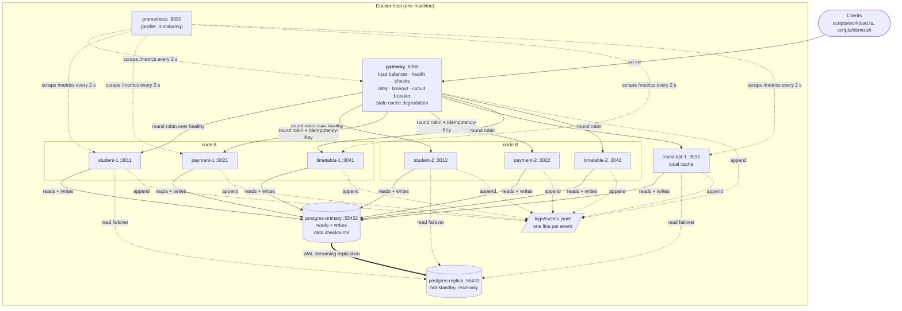

# System architecture

## Deployment diagram

`node A` / `node B` are logical groupings: the node-failure experiment kills
student-1 and payment-1 together to model the loss of one physical machine. All
containers actually share one Docker host, which is itself a single point of
failure (see REPORT.md §4.4). Prometheus scrapes all eight instances; the diagram
shows only a few of the arrows to stay readable.

## Components

| Component | Instances | Data it owns | Fault-tolerance role |
|---|---|---|---|
| gateway | 1 | in-memory health map, last-good GET responses | load balancing, health checks, retry with backoff, per-attempt timeout, circuit breaker, Idempotency-Key propagation, stale-cache degradation |
| student | 2 | `students` | replicated, stateless; read failover to the standby |
| payment | 2 | `payments` | idempotency (`UNIQUE idempotency_key`), checkpoint before charge, rollback sweep for orphaned checkpoints |
| transcript | 1 | `grades` (read-only) + local cache | graceful degradation: stale data flagged `degraded` (HTTP 203) when the database is gone |
| timetable | 2 | `courses`, `rooms`, `timetable_jobs` | long-running jobs with durable checkpoints; a live replica adopts the job of a dead one (lease + `SKIP LOCKED`) and resumes it |
| postgres-primary | 1 | everything | the only writable copy; page checksums |
| postgres-replica | 1 | streaming copy | hot standby for reads |
| prometheus | 1 (optional) | time series | independent liveness (`up`) and live mechanism counters |

## Request flow

1. A client calls `GET|POST /api/{students|payments|transcripts|timetables}/...` on
   the gateway.
2. The gateway picks the next **healthy** instance of that pool (the baseline
   picks the next instance, healthy or not). A POST without an `Idempotency-Key`
   gets one generated here, so a retry reuses it.
3. `app/ft.py:call()` runs the attempt under an 800 ms timeout. A transport error
   or 5xx is retried on the *next* instance of the ring with exponential backoff
   and full jitter, up to 3 attempts. Five consecutive failures open the pool's
   circuit breaker for 5 s.
4. If every attempt fails on a GET, the gateway answers from its last-good copy
   (HTTP 203, `degraded: true`) when that copy is less than 60 s old.
5. Each service logs one `request` event per call, and every mechanism logs the
   event that proves it fired (`attempt`, `breaker`, `recovery`, `degraded`,
   `checkpoint`, ...). The experiment metrics are computed from this log; the
   same events are exported as Prometheus counters on `GET /metrics`.

## Baseline vs fault-tolerant

Both versions run the **same image**. `FT_ENABLED=0` turns off every software
mechanism above (one attempt, no timeout, no breaker, blind round robin, no
replica failover, idempotency key ignored, no recovery sweeps, no timetable
checkpoints),
and `RESTART_POLICY=no` turns off self-healing. Replicas, the standby and the
checksums exist in both: hardware redundancy without the software that uses it is
exactly what the baseline measures.
