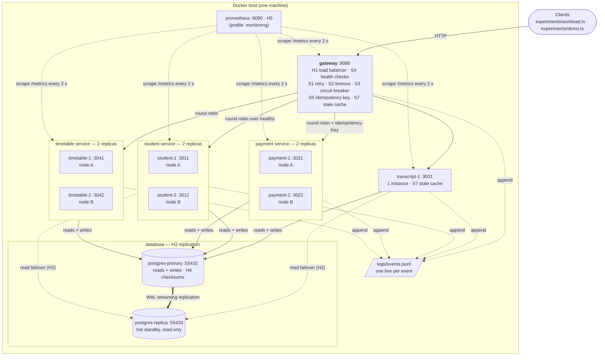
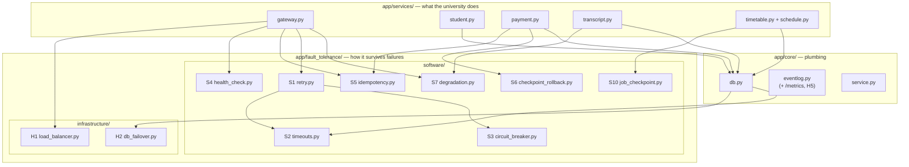

# System architecture

## 1. Deployment: what runs, and the two replicas of each service

* **Two replicas** of student, payment and timetable: losing one leaves the
  service up (H1). The gateway, transcript-1, postgres-primary and the host itself
  are single instances — the remaining single points of failure (REPORT.md §4.4).
* **Node A / node B** are logical: the node-failure experiment kills student-1 and
  payment-1 together to model one machine dying. All containers share one host.
* **H3 self-healing** is not a box: it is `restart: unless-stopped` on every
  container in the FT version.

## 2. Code: business logic and fault tolerance are separate layers

The full list of mechanisms, with file links, is in
[`app/fault_tolerance/README.md`](../app/fault_tolerance/README.md).

## 3. Components

| Component | Instances | Data it owns | Fault-tolerance role |
|---|---|---|---|
| gateway | 1 | in-memory health map, last-good GET responses | H1, S1, S2, S3, S4, S5 (key propagation), S7 |
| student | **2** | `students` | replicated, stateless; reads fail over to the standby (H2) |
| payment | **2** | `payments` | S5 idempotency, S6 checkpoint before charge + rollback sweep |
| transcript | 1 | `grades` (read-only) + local cache | S7: stale data flagged `degraded` (HTTP 203) when the database is gone |
| timetable | **2** | `courses`, `rooms`, `timetable_jobs` | S10: durable checkpoints; a live replica adopts a dead one's job |
| postgres-primary | 1 | everything | the only writable copy; H4 page checksums |
| postgres-replica | 1 | streaming copy | H2 hot standby for reads |
| prometheus | 1 (optional) | time series | H5 independent liveness (`up`) and live mechanism counters |

## 4. Request flow

1. A client calls `GET|POST /api/{students|payments|transcripts|timetables}/...` on
   the gateway.
2. **H1 + S4:** the gateway picks the next **healthy** replica of that service (the
   baseline picks the next replica, healthy or not).
3. **S5:** a POST without an `Idempotency-Key` gets one here, so a retry reuses it.
4. **S2 + S1 + S3:** the call runs under an 800 ms timeout. A transport error or
   5xx is retried on the *next* replica with exponential backoff and full jitter,
   up to 3 attempts. Five consecutive failures open the pool's circuit breaker
   for 5 s.
5. **S7:** if every attempt fails on a GET, the gateway answers from its last-good
   copy (HTTP 203, `degraded: true`) when that copy is less than 60 s old.
6. Each service logs one `request` event per call, and every mechanism logs the
   event that proves it fired (`attempt`, `breaker`, `recovery`, `degraded`,
   `checkpoint`, ...) to `logs/events.jsonl`. All experiment metrics are computed
   from this log; the same events are exported as Prometheus counters on
   `GET /metrics`.

## 5. Baseline vs fault-tolerant

Both versions run the **same image**. `FT_ENABLED=0` turns off every software
mechanism (one attempt, no timeout, no breaker, blind round robin, no standby
reads, idempotency key ignored, no recovery sweeps, no timetable checkpoints),
and `RESTART_POLICY=no` turns off self-healing. The replicas, the standby and the
checksums exist in both: hardware redundancy without the software that uses it
is exactly what the baseline measures.
